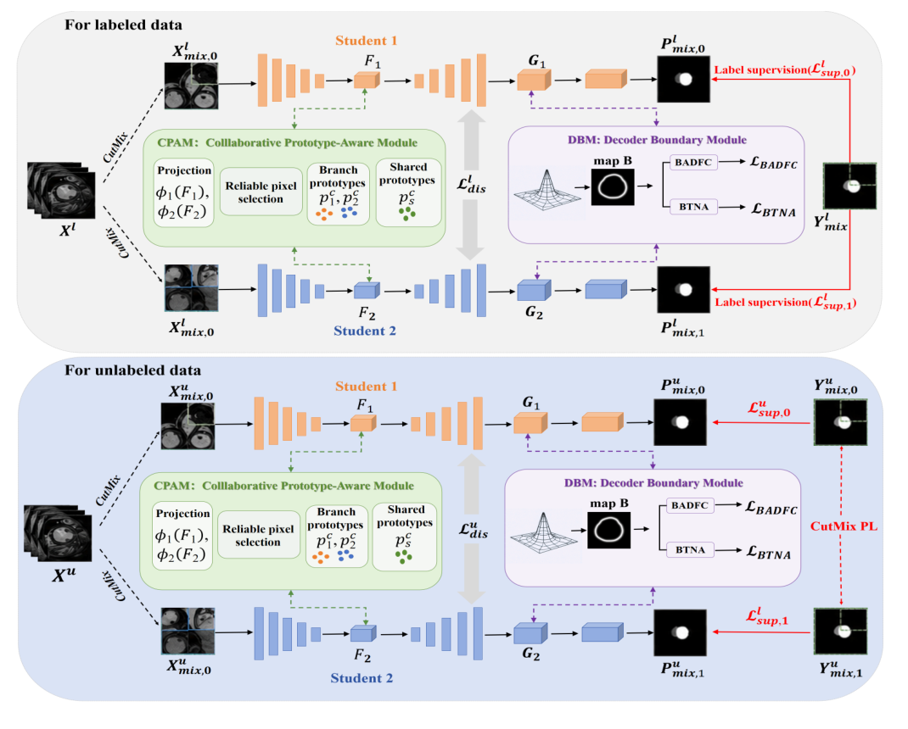

# CPBNet: Collaborative Prototype and Boundary Enhancement Network for Semi-Supervised Medical Image Segmentation



> **Collaborative Prototype and Boundary Enhancement Network for Semi-Supervised Medical Image Segmentation**  
> Cheng Wang, Ran Wang, Xu Liu, Qiqi Fang, Xiaogao Jiang, Qi Luo, Jiawen Zhu, and Wanggen Li  
> Code: [CPBNet](https://github.com/wangran20021226-crypto/CPBNet)

This is an official PyTorch implementation of **CPBNet: Collaborative Prototype and Boundary Enhancement Network for Semi-Supervised Medical Image Segmentation**.

## Abstract

Semi-supervised medical image segmentation aims to reduce the dependence on dense pixel- or voxel-level annotations by jointly using limited labeled data and abundant unlabeled data. Existing dual-student methods mainly impose supervision in the output or pseudo-label space, which may suffer from pseudo-label noise, cross-branch semantic drift, and weak boundary discrimination.

We propose **CPBNet**, a collaborative prototype and boundary enhancement network built on a dual-student mutual learning framework. CPBNet introduces two complementary modules: **Collaborative Prototype-Aware Module (CPAM)** and **Decoder Boundary Enhancement Module (DBM)**. CPAM selects reliable pixels based on cross-branch prediction agreement and confidence, constructs shared class prototypes, and maintains them with a momentum memory bank. DBM explicitly enhances boundary representations in the high-resolution decoder feature space via boundary-aware decoder feature contrast and boundary tangential-normal anisotropy. Experiments on **ACDC**, **LA**, and **BraTS2019** demonstrate that CPBNet achieves competitive semi-supervised segmentation performance under different annotation ratios.

## Requirements

The experiments in our paper were conducted on an `NVIDIA RTX 3090` GPU. A typical environment is listed below:

* Ubuntu 20.04 / 22.04
* Python 3.8
* PyTorch >= 1.10
* CUDA >= 11.3

Install the main dependencies:

```bash
conda create -n cpbnet python=3.8 -y
conda activate cpbnet

# Please install PyTorch according to your CUDA version.
# See: https://pytorch.org/get-started/locally/
pip install torch torchvision torchaudio

pip install numpy scipy scikit-image h5py nibabel SimpleITK medpy tqdm tensorboardX
```

## Datasets

The datasets used in this paper can be downloaded from the following links:

* **ACDC**: [Automated Cardiac Diagnosis Challenge](https://www.creatis.insa-lyon.fr/Challenge/acdc/)
* **LA**: [2018 Atrial Segmentation Challenge](https://www.cardiacatlas.org/atriaseg2018-challenge/)
* **BraTS2019**: [BraTS 2019 Challenge](https://www.med.upenn.edu/cbica/brats2019/data.html)

Please preprocess the datasets following the commonly used SSL4MIS/CML data format. The expected directory structure is:

```text
data/
├── ACDC/
│   ├── train_slices.list
│   ├── val.list
│   ├── test.list
│   └── data/
│       ├── slices/
│       │   └── *.h5
│       └── *.h5
└── LA/
    ├── train.list
    ├── test.list
    └── 2018LA_Seg_Training Set/
        └── <case_name>/
            └── mri_norm2.h5
```

The default data paths are:

```text
../data/ACDC
../data/LA
```

You can also specify the dataset path using `--root_path`.

## Usage

### Training

To train CPBNet on **ACDC**, run:

```bash
python CML_ACDC_train.py \
  --root_path ../data/ACDC \
  --gpu 0 \
  --labelnum 7 \
  --batch_size 24 \
  --labeled_bs 12 \
  --pre_iterations 10000 \
  --train_iterations 30000 \
  --exp CPBNet_ACDC_10percent
```

For the **5% labeled** ACDC setting, set `--labelnum 3`:

```bash
python CML_ACDC_train.py \
  --root_path ../data/ACDC \
  --gpu 0 \
  --labelnum 3 \
  --batch_size 24 \
  --labeled_bs 12 \
  --pre_iterations 10000 \
  --train_iterations 30000 \
  --exp CPBNet_ACDC_5percent
```

You can also run the provided script:

```bash
bash run_dbm_dice_3_aggressive.sh
```

To train CPBNet on **LA**, run:

```bash
python CML_LA_train.py \
  --root_path ../data/LA \
  --gpu 0 \
  --labelnum 8 \
  --batch_size 8 \
  --labeled_bs 4 \
  --pre_max_iteration 2000 \
  --train_max_iteration 15000 \
  --exp CPBNet_LA_10percent
```

For the **5% labeled** LA setting, set `--labelnum 4`:

```bash
python CML_LA_train.py \
  --root_path ../data/LA \
  --gpu 0 \
  --labelnum 4 \
  --batch_size 8 \
  --labeled_bs 4 \
  --pre_max_iteration 2000 \
  --train_max_iteration 15000 \
  --exp CPBNet_LA_5percent
```

### Evaluation

To evaluate the model on **ACDC**, run:

```bash
python test_ACDC.py \
  --root_path ../data/ACDC \
  --model unet \
  --num_classes 4 \
  --labelnum 7 \
  --stage_name train \
  --exp CPBNet_ACDC_10percent
```

To evaluate the model on **LA**, run:

```bash
python test_LA.py \
  --root_path ../data/LA \
  --gpu 0 \
  --model VNet \
  --labelnum 8 \
  --stage_name train \
  --exp CPBNet_LA_10percent
```

The trained checkpoints are saved under:

```text
./model/CML/ACDC_<exp>_<labelnum>_labeled/
./model/CML/LA_<exp>_<labelnum>_labeled/
```

## Citation

If you find this work useful in your research, please star our repository and consider citing:

```bibtex
@article{wang2026cpbnet,
  title={Collaborative Prototype and Boundary Enhancement Network for Semi-Supervised Medical Image Segmentation},
  author={Wang, Cheng and Wang, Ran and Liu, Xu and Fang, Qiqi and Jiang, Xiaogao and Luo, Qi and Zhu, Jiawen and Li, Wanggen},
  journal={IEEE Transactions on Medical Imaging},
  year={2026}
}
```

## Contact

For technical questions, please contact via: `syqkzw@gmail.com`.

## Acknowledgements

Our code is built upon the dual-student mutual learning framework and follows the commonly used semi-supervised medical image segmentation codebase style. We thank the authors of [SSL4MIS](https://github.com/HiLab-git/SSL4MIS), CML, and other open-source semi-supervised medical image segmentation projects for their valuable work.
